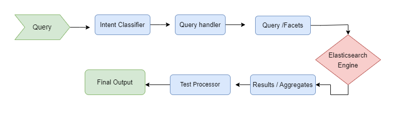

# Sinhala Song’s Metaphor Search Engine Using Elasticsearch 

This repository contain source code for Sinhala song search engine created using Python and Elasticsearch

## Directory Structure

The important files and directories of the repository is shown below

    ├── sinhala_songs_corpus : Data scraped from the [website](http://sinhalasongbook.com/)                    
        ├── song_output.json : Original songs scraped form the website
        ├── sinhala_songs : Source code for the data scraper
    ├── elastic_search_indexing :Source code for Elasticsearch Indexing
        ├── add_data.py : File to upload data to elasticsearch cluster
        ├── indexing_settings.json :  Settings file to create index 
        ├── sinhala_song_lyrics.json : Final Sinhala translated songs data
           


## Starting the web app

### Spinning the elasticsearch cluster

You can install elasticsearch locally or otherwise and spin up the elasticsearch cluster
For more details visit [website](https://www.elastic.co/guide/en/elasticsearch/reference/current/getting-started-install.html)

Once elasticsearch is install, start elasticsearch cluster on port 9200

### Getting started with the web app

```commandline
cmd : git clone https://github.com/LahiruKumaraHewagama/SinhalaSongsSearchEngine_180186X

cmd : cd SinhalaSongsSearchEngine_180186X

cmd : pip3 install -r requirements.txt

# Run spider:
go to directory of sinhala_songs_corpus/sinhala_songs_scraper and run
cmd:  scrapy crawl sinhala_songs_spider -o song_output.json

# To translate:
cmd : python sinhala_translater.py

# Create index with settings(index name - sinhala-songs)
create index using PUT sinhala-songs {indexing_settings.json file data}
cmd: curl -X PUT "localhost:9200/sinhala-songs?pretty" -H "Content-Type: application/json" -d @indexing_settings.json

# Add bulk data
cmd : python add_data.py

```


## Data fields 

Each song contain subset of following data fields

1. TitleSinglish - Title of the song in English fonts 
2. TitleSinhala - Title of the song in Sinhala fonts 
3. ArtistName - comma separated list of artist names in English fonts 
4. Genre - List of genres in Sinhala fonts
5. Lyricist - comma separated list of Lyrics writer names in English fonts 
6. Music - comma separated list of music creators name in English fonts
7. Views - The count of views of the song
8. Lyrics - Lyrics in Sinhala fonts
9. Metaphors- List of Metaphors in Sinhala fonts
    * Metaphor - Metaphor of the song in Sinhala fonts
    * Meaning - Meaning of the Metaphor in Sinhala fonts
    * SourceDomain - Source Domain of the Metaphor in Sinhala fonts
    * TargetDomain - Target Domain of the Metaphor in Sinhala fonts

## Data Scraping process

The process with scraping data from the site, the HTML/XML parsing library BeautifulSoup was used for scraping the web pages. Then the text extracted was passed through the text processing unit. Both simple techniques like replacing complex methods like regex are used for this process. This text processing unit generates cleaned text data which is then passed to the translator to translate to Sinhala, here both translation and transliteration takes place. Then the translated data is sent for post processing and the final data set with an aggregated dataset containing information about fields is generated


## Search Process

### Indexing and quering

For indexing the data and querying the Elasticsearch is used and I have used the standard 
indexing methods, mapping and the analyzer provided in the Elasticsearch. The different 
filters (edge_ngram filter, char_filter and stop word filters) and different tokenizers
(standard, classic and icu_tokenizer) will be used to define 3 analyzers and 2 search 
analyzers. Finally map the properties with suitable types and adding analyzers and fields.

In the Querying part one of query type is search data by considering multi fields. I used 
boosting to give weight for some fields by their search query analyzing. Another type is 
sorting the data by considering views count of the song and by analyzing search query. Next 
type is considering the genre type of the search query, grouping them and giving search 
results. Also filtered queries are provided where users can filter the search result.

## Advance Features                  
* Text mining and text preprocessing
    * Search queries are processed before intent classification, here spelling errors are corrected and the query is cleaned. Also data extracted is also cleaned and processed before displaying on the web application.
* Intent Classification
    * Once the query is added, intent behind the query is found by intent classification. The intent could be simple text search or a select top type, etc. The intent classifier used word tokenization and text vectorization and cosine distance to classify intentens
* Faceted Search
    * The search engine supported faceted search related to Genre, Artist, Composer and Lyricist. 
* Bilingual & Synonyms support
    * The search engine supports queries in both Sinhala and English.
* Resistant to simple spelling errors
    * Due to the use of vectorization and distance calculation the search engine is resistant to small spelling errors and these are automatically corrected and related search results are generated.





